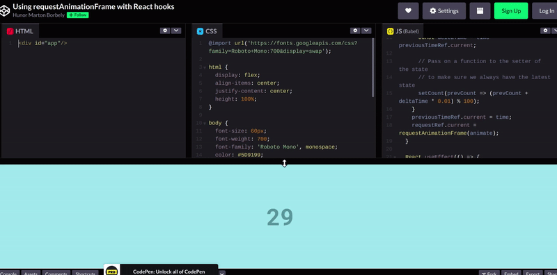

### Using requestAnimationFrame with React Hooks

[Using requestAnimationFrame with React Hooks](https://css-tricks.com/using-requestanimationframe-with-react-hooks/)

> Animating with requestAnimationFrame should be easy, but if you haven’t read React’s documentation thoroughly then you will probably run into a few things that might cause you a headache. Here are three gotcha moments I learned the hard way.

> TLDR: Pass an empty array as a second parameter for useEffect to avoid it running more than once and pass a function to your state’s setter function to make sure you always have the correct state. Also, use useRef for storing things like the timestamp and the request’s ID.

#### useRef is not only for DOM references

##### There are three ways to store variables within functional components:

> We can define a simple const or let whose value will always be reinitialized with every component re-rendering.
> We can use useState whose value persists across re-renderings, and if you change it, it will also trigger re-rendering.
> We can use useRef.
> The useRef hook is primarily used to access the DOM, but it’s more than that. It is a mutable object that persists a value across multiple re-renderings. It is really similar to the useState hook except you read and write its value through its .current property, and changing its value won’t re-render the component.

##### For instance, the example below will always show 5 even if the component is re-rendered by its parent.

```javascript
function Component() {
  let variable = 5;

  setTimeout(() => {
    variable = variable + 3;
  }, 100);

  return <div>{variable}</div>;
}
```

##### …whereas this one will keep increasing the number by three and keeps re-rendering even if the parent does not change.

```javascript
function Component() {
  const [variable, setVariable] = React.useState(5);

  setTimeout(() => {
    setVariable(variable + 3);
  }, 100);

  return <div>{variable}</div>;
}
```

##### And finally, this one returns five and won’t re-render. However, if the parent triggers a re-render then it will have an increased value every time (assuming the re-render happened after 100 milliseconds).

```javascript
function Component() {
  const variable = React.useRef(5);

  setTimeout(() => {
    variable.current = variable.current + 3;
  }, 100);

  return <div>{variable.current}</div>;
}
```

### 👿👿👿

> **If we have mutable values that we want to remember at the next or later renders and we don’t want them to trigger a re-render when they change, then we should use useRef.** _In our case, we will need the ever-changing request animation frame ID at cleanup, and if we animate based on the the time passed between cycles, then we need to remember the previous animation’s timestamp_. These two variables should be stored as refs.

### 👿👿👿

<br>

# The side effects of useEffect

> **We can use the useEffect hook to initialize and cleanup our requests, though we want to make sure it only runs once; otherwise it’s going to end up creating, canceling and re-creating the animation frame request at every render**.

## Here’s a working, but bad example:

```javascript
function App() {
  const [state, setState] = React.useState(0);

  const requestRef = React.useRef();

  const animate = (time) => {
    // Change the state according to the animation
    requestRef.current = requestAnimationFrame(animate);
  };

  // DON’T DO THIS
  React.useEffect(() => {
    requestRef.current = requestAnimationFrame(animate);
    return () => cancelAnimationFrame(requestRef.current);
  });

  return <div>{state}</div>;
}
```

> **Why is it bad? If you run this, the useEffect will trigger the animate function that will both change the state and request a new animation frame. It sounds good, except that the state change will re-render the component by running the whole function again including the useEffect hook that will first as a cleanup cancel the request made by the animate function in the previous cycle and then spin up a new request.**

> This ultimately replaces the request made by the animate function and it’s **completely unnecessary**. We could avoid this by not spinning up a new request in the animate function, but that still wouldn’t be so nice.

> It would still leave us with an **unnecessary cleanup every round** and if the component re-renders for some other reason — like the parent re-renders it or some other state has changed — then the unnecessary cancelation and request re-creation would still happen.

> **It is a better pattern to only initialize requests once, keep them spinning by the animate function and then cleanup once when the component unmounts**.

<br>

> To make sure **the useEffect hook runs only once**, we can **pass an empty array as a second argument to it**. _Passing an empty array has a side-effect though_, which avoids us from having the correct state during animation.

> **The second argument is a list of changing values that the effect needs to react to** We don’t want to react to anything — we only want to initialize the animation — hence we have the empty array. But React will interpret this in a way that means this effect doesn’t have to be up to date with the state\*\*. And that includes the animate function because it was originally called from the effect.

> **As a result, if we try to get the value of the state in the animate function, it will always be the initial value**. If we want to change the state based on its previous value and the time passed, then it probably won’t work.

```javascript
function App() {
  const [state, setState] = React.useState(0);

  const requestRef = React.useRef();

  const animate = (time) => {
    // The 'state' will always be the initial value here
    requestRef.current = requestAnimationFrame(animate);
  };

  React.useEffect(() => {
    requestRef.current = requestAnimationFrame(animate);
    return () => cancelAnimationFrame(requestRef.current);
  }, []); // Make sure the effect runs only once

  return <div>{state}</div>;
}
```

# 🌵

# The state’s setter function also accepts a function

> **There’s a way to use our latest state even if the useEffect hook locked our state to its initial value**. The setter function of the useState hook can also accept a function. So instead of passing a value based on the current state as you probably would do most of the time:

```javascript
setState(state + delta);
```

> … you can also pass on a function that receives the previous value as a parameter. And, yes, that’s going to return the correct value even in our situation:

```javascript
setState((prevState) => prevState + delta);
```

# Putting it all together

> Here’s a simple example to wrap things up. **We’re going to put all of the above together to create a counter that counts up to 100 then restarts from the beginning**.

> Technical **variables that we want to persist and mutate without re-rendering the whole component** are stored with useRef. We made sure useEffect only runs once by passing an empty array as its second parameter. And we mutate the state by passing on a function to the setter of useState to make sure we always have the correct state.

##### check the working example (you will see the counter working, counting until 100)

```javascript
const Counter = () => {
  const [count, setCount] = React.useState(0);

  // Use useRef for mutable variables that we want to persist
  // without triggering a re-render on their change
  const requestRef = React.useRef();
  const previousTimeRef = React.useRef();

  const animate = (time) => {
    if (previousTimeRef.current != undefined) {
      const deltaTime = time - previousTimeRef.current;

      // Pass on a function to the setter of the state
      // to make sure we always have the latest state
      setCount((prevCount) => (prevCount + deltaTime * 0.01) % 100);
    }
    previousTimeRef.current = time;
    requestRef.current = requestAnimationFrame(animate);
  };

  React.useEffect(() => {
    requestRef.current = requestAnimationFrame(animate);
    return () => cancelAnimationFrame(requestRef.current);
  }, []); // Make sure the effect runs only once

  return <div>{Math.round(count)}</div>;
};

ReactDOM.render(<Counter />, document.getElementById("app"));
```

[]()

<br>
<br>

## Update: Taking the extra mile with a custom Hook

> Once the basics are clear we can also go meta with Hooks, by extracting most of our logic into a custom Hook. This will have **two benefits:**

> **It greatly simplifies our component, hiding technical variables that are related to the animation, but not to our main logic
> Custom Hooks are reusable**.

> **If you need an animation in another component you can simply use it there as well**
> Custom Hooks might sound like an advanced topic at first, but ultimately **we just move a part of our code from our component to a function, then call that function in our component just like any other function**.

> As a convention, a custom **Hook’s** name should start with the use keyword and the rules of Hooks apply, but otherwise, they **are just simple functions that we can customize with inputs and that might return something**.

> _In our case to make a generic Hook for requestAnimationFrame we can pass on a callback that our custom Hook will call at every animation cycle. This way our main animation logic will stay in our component, but the component itself will be more focused._

```javascript
const useAnimationFrame = (callback) => {
  // Use useRef for mutable variables that we want to persist
  // without triggering a re-render on their change
  const requestRef = React.useRef();
  const previousTimeRef = React.useRef();

  const animate = (time) => {
    if (previousTimeRef.current != undefined) {
      const deltaTime = time - previousTimeRef.current;
      callback(deltaTime);
    }
    previousTimeRef.current = time;
    requestRef.current = requestAnimationFrame(animate);
  };

  React.useEffect(() => {
    requestRef.current = requestAnimationFrame(animate);
    return () => cancelAnimationFrame(requestRef.current);
  }, []); // Make sure the effect runs only once
};

const Counter = () => {
  const [count, setCount] = React.useState(0);

  useAnimationFrame((deltaTime) => {
    // Pass on a function to the setter of the state
    // to make sure we always have the latest state
    setCount((prevCount) => (prevCount + deltaTime * 0.01) % 100);
  });

  return <div>{Math.round(count)}</div>;
};

ReactDOM.render(<Counter />, document.getElementById("app"));
```
